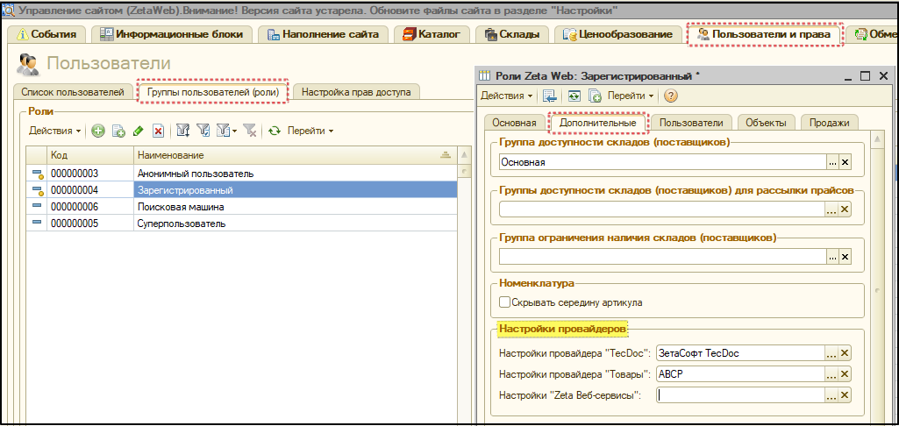

# Как изменять контент для роботов и других анонимных клиентов на сайте?

**Поисковые роботы \(или боты\)** — являются составной частью поисковой системы и предназначены для перебора страниц Интернета с целью занесения информации о них в базу данных поисковика.

Определить бота можно по данным из **User Agent** - строке, которую используют веб-браузеры в качестве своего имени, содержащую не только имя браузера и другие параметры. 

Для работы с функционалом по замене контента для роботов и анонимных клиентов, в системе реализована возможность создавать для них отдельную **Роль**.

### Роль для поисковой машины

Для создания отдельной роли необходимо пройти по ссылке меню **Операции → Справочники → Роли \(Zeta Web\)**, нажать на **«Создать»** и задать ей необходимые права.





Далее, следует перейти в **Панель управления сайтом →** вкладка **Настройки →** вкладка **Домены** и открыть соответствующий **домен**.

В открывшейся форме на вкладке **Продажи** перейдите к реквизиту **Роль для поисковой машины** и ****указать в нем ранее созданную роль.

На рисунке выше, наглядно продемонстрирован процесс создания роли и указание ее в настройках домена. В процессе создания роли для поисковой машины, важно, оставить **настройки провайдеров** _\(вкладка **Дополнительно**\)_ - не заполненными. 

### Справочник «Статистика посещений сайта: Боты \(Zeta Web\)»

Для того, чтобы перейти к настройкам функционала, прежде всего, следует перейти по ссылке **Zeta Web → Настройки и администрирование → Служебная статистика → Статистика посещения сайта: Боты.**

В открывшемся окне справочника необходимо создать запись и внести данные настроек поискового бота, а именно, заполнить поля:

* **Наименование**;
* **Поисковая машина** _\(выбрать из справочника "Статистика поисковых машин \(Zeta Web\)"\)_;
* **Маска поиска в UserAgent** _\(указать шаблон поискового запроса\)._

_На рисунке ниже представлен пример настройки для всех ботов Yandex._

Так, например,  **%** _**\(процент\)**_ в строке маски поиска**,** на рисунке выше, обозначает поиск по вхождению. Таким образом, в соответствии с информацией, указанной в ****поле **UserAgent**_,_ данный запрос будет идентифицирован, как запрос от бота и ему будет назначена роль, указанная в домене.

### Роль для поисковой машины

По окончанию создания настройки в справочнике, необходимо перейти в **Панель управления сайтом →** вкладка **Настройки →** вкладка **Домены** и открыть соответствующий домен.

В открывшейся форме на вкладке **Продажи** перейдите к реквизиту **Роль для поисковой машины**. Для того, чтобы указать роль в домене, следует создать новую роль _**\(Операции → Справочники → Роли \(Zeta Web\)\)**_ и задать ей необходимые права.

На рисунке выше, наглядно продемонстрирован процесс создания роли и указание ее в настройках домена. В процессе создания роли для поисковой машины, важно, оставить **настройки провайдеров** _\(вкладка **Дополнительно**\)_ - не заполненными. 

### Контроль запросов ABCP

В **ролях**, которым предполагается предоставить доступ к ABCP, необходимо указать **настройки провайдера**.

В случае, если в роли данные настройки не будут прописаны _\(см.Рисунок 2\)_, настройки провайдера будут взяты из **настроек контролов поиска**.

В связи с чем, для того, чтобы исключить напрасную трату запросов ABCP, необходимо, чтобы в контролах поиска не была заполнена **Настройка провайдера TecDoc**. 

Таким образом, поиск с ABCP будет производиться в рамках настроенной роли, а, на примере, ранее созданной роли для поисковых машин запросы использоваться не будут, т.к. настройки провайдеры не указаны как в роли, так и в контроле поиска.

